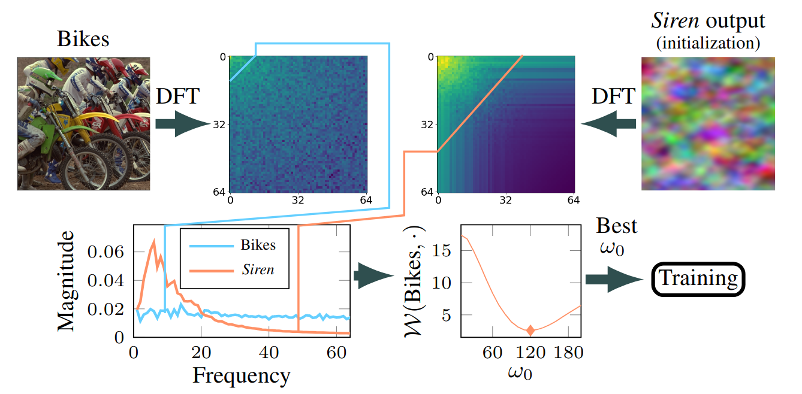
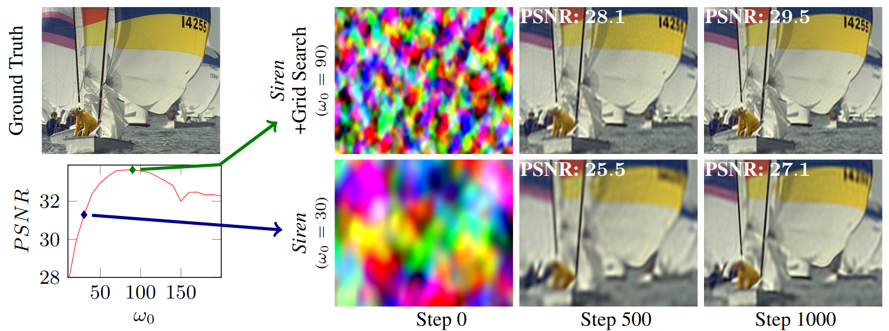

<p align="center">
  <p align="center">
    <h1 align="center">FreSh: Frequency Shifting for Accelerated Neural Representation Learning</h1>
  </p>
  <p align="center" style="font-size:16px">
    <a target="_blank" href="https://www.linkedin.com/in/adam-kania-r/"><strong>Adam Kania</strong></a>
    ·
    <a target="_blank" href="https://markomih.github.io/"><strong>Marko Mihajlovic</strong></a>
    ·
    <a target="_blank" href="https://vlg.inf.ethz.ch/team/Dr-Sergey-Prokudin.html"><strong>Sergey Prokudin</strong></a>
    ·
    <a target="_blank" href="https://matinf.uj.edu.pl/pracownicy/wizytowka?person_id=Jacek_Tabor"><strong>Jacek Tabor</strong></a>
    ·
    <a target="_blank" href="https://matinf.uj.edu.pl/pracownicy/wizytowka?person_id=Przemyslaw_Spurek"><strong>Przemysław Spurek</strong></a>
  </p>

[//]: ## (  <h2 align="center">conference</h2>)
  <div align="center"></div> 

  <p align="center">
    <a href="https://pytorch.org/get-started/locally/"></a>
    <a href="https://pytorchlightning.ai/"></a>
    <br>

[//]: ## (    <a href='arxiv link'>)
[//]: ## (      )
[//]: ## (    </a>)
[//]: ## (    <a href='project page' style='padding-left: 0.5rem;'>)

[//]: ## (      )

[//]: ## (    </a>)
  </p>
<p align="center">

Fresh re-configures  embedding layers to align the frequencies of an INR with its target signal before training starts.
This improves convergence speed and performance on a variety of tasks, as the effective learning speed is 
frequency-dependent (meaning that higher frequencies are slower to fit).

The algorithm of Fresh is relatively straightforward:
1. Calculate the Discrete Fourier Transform (DFT) of the target signal and the model output.
2. Sum across diagonals of the DFT to get the spectrum. (diagonal = the same frequency, but different direction)
3. Select the model configuration where the Wasserstein distance between the target and model spectrum is minimized.
4. Train the model with the selected configuration.

This approach is much more efficient than performing a grid-search, where you would train multiple models.
Here is an example of how it looks in practice:



Thanks to this approach, small details are modeled much faster:



In essence, FreSh is an efficient alternative to a conventional grid search which avoids training multiple models. 
This allows FreSh to quickly test multiple hyperparameter values:

| Model                | Grid Search (estimated time) | FreSh (+training) | Number of tested configurations | Number of fitted images |
|----------------------|---------------------------|-----------------------|---------------------------------|-------------------------|
| Siren                | 600 h                     | **31** h              | 20                              | 50                      |
| Fourier              | 493 h                     | **25** h              | 20                              | 50                      |
| Finer                | 1018 h                    | **37** h              | 31                              | 50                      |
| Finer (without bias) | 625 h                     | **35** h              | 20                              | 50                      |

The time required by Fresh is quite small, with the majority of the time spent on training the model:

| Model                | Training time | Number of fitted images |
|----------------------|---------------|-------------------------|
| Siren                | 29 h          | 50                      |
| Fourier              | 23 h          | 50                      |
| Finer                | 33 h          | 50                      |
| Finer (without bias) | 32 h          | 50                      |


## Setup
#### Code
Setup environment:
```
conda env create --file environment.yaml
conda activate fresh
pip install random-fourier-features-pytorch deeplake
```
Log into [Weights & Biases](https://docs.wandb.ai/quickstart):
```
wandb login
```

#### Data
Download image datasets and save them in the `data` folder.
```
# For faster training later, lower the amount of images (`num_images`).
cd scripts

python get_datasets.py --data_root=../data --dataset=kodak --num_images=10
python get_datasets.py --data_root=../data --dataset=ffhq --num_images=10
python get_datasets.py --data_root=../data --dataset=wiki-art --num_images=10
python get_datasets.py --data_root=../data --dataset=chest-xray-train --num_images=10
```


## Experiments

#### Image experiments
To recreate results from the paper, we recommend using [slurm array jobs](https://slurm.schedmd.com/job_array.html).  
In the commands below, `SLURM_ARRAY_TASK_ID` is an integer ranging from 0 to `#CONFIGS-1`. 
The total number of configurations (`#CONFIGS`) can be calculated by passing
an additional argument to the training command (`--count`) 
(alternatively you can count how many configurations are defined in the configuration file and multiply them by the dataset size).

Train FreSh with Siren:
```
python src/train.py --dataset_sources='["data/ffhq_1024_10","data/ffhq_wild_10","data/kodak_10","data/chest_xray_10","data/wiki_art_10",]' \
  --conf=configs/siren_best_omega.yaml \
  logger.save_dir=...   checkpoints_path=... \
  logger.group=siren_best --config_id=$SLURM_ARRAY_TASK_ID
```

Train FreSh with Fourier features:
```
python src/train.py --dataset_sources='["data/ffhq_1024_10","data/ffhq_wild_10","data/kodak_10","data/chest_xray_10","data/wiki_art_10",]' \
  --conf=configs/relu_best_sigma.yaml \
  logger.save_dir=...  checkpoints_path=... \
  logger.group=siren_baseline --config_id=$SLURM_ARRAY_TASK_ID
```
Train FreSh with Finer:
```
## Optimize bias
python src/train.py --dataset_sources='["data/ffhq_1024_10","data/ffhq_wild_10","data/kodak_10","data/chest_xray_10","data/wiki_art_10",]' \
  --conf=configs/finer_best_bias.yaml \
  logger.save_dir=...  checkpoints_path=... \
  logger.group=siren_baseline --config_id=$SLURM_ARRAY_TASK_ID

## Optmize omega, bias=0
python src/train.py --dataset_sources='["data/ffhq_1024_10","data/ffhq_wild_10","data/kodak_10","data/chest_xray_10","data/wiki_art_10",]' \
  --conf=configs/finer_best_omega.yaml \
  logger.save_dir=...  checkpoints_path=... \
  logger.group=siren_baseline --config_id=$SLURM_ARRAY_TASK_ID
```


Train baseline Siren (ω = 30):
```
python src/train.py --dataset_sources='["data/ffhq_1024_10","data/ffhq_wild_10","data/kodak_10","data/chest_xray_10","data/wiki_art_10",]' \
  --conf=configs/siren_base.yaml \
  logger.save_dir=...    checkpoints_path=... \
  logger.group=siren_baseline --config_id=$SLURM_ARRAY_TASK_ID
```

Train baseline Fourier features (σ = 1):
```
python src/train.py --dataset_sources='["data/ffhq_1024_10","data/ffhq_wild_10","data/kodak_10","data/chest_xray_10","data/wiki_art_10",]' \
  --conf=configs/relu_base.yaml \
  logger.save_dir=...   checkpoints_path=... \
  logger.group=relu_baseline --config_id=$SLURM_ARRAY_TASK_ID
```

Train baseline Finer:
```
python src/train.py --dataset_sources='["data/ffhq_1024_10","data/ffhq_wild_10","data/kodak_10","data/chest_xray_10","data/wiki_art_10",]' \
  --conf=configs/finer_base.yaml \
  logger.save_dir=...   checkpoints_path=... \
  logger.group=relu_baseline --config_id=$SLURM_ARRAY_TASK_ID
```

Train Wire:
```
python src/train.py --dataset_sources='["data/ffhq_1024_10","data/ffhq_wild_10","data/kodak_10","data/chest_xray_10","data/wiki_art_10",]' \
  --conf=configs/wire_base.yaml \
  logger.save_dir=...   checkpoints_path=... \
  logger.group=relu_baseline --config_id=$SLURM_ARRAY_TASK_ID
```

**Debugging** By default, models are trained on GPU but debugging on CPU is also possible:
```
python src/train.py --datasets='["data/kodak/2.png", "data/kodak/4.png"]' \
  --conf=configs/siren_best_omega.yaml \
  epochs=200 logger.val_check_interval=20 \
  accelerator=cpu \
  logger.group=debug 
```
#### Video experiments

We use [ResFields](https://github.com/remilvus/ResFields) for video. Follow the link for setup instructions and related experiments.

#### NeRF experiments

We use [torch-ngp](https://github.com/remilvus/torch-ngp) for NeRF experiments. Follow the link for setup instructions and related experiments.

## Improving your model with FreSh
To configure the embedding of your model with FreSh follow these steps:
1. Save your dataset as a npy file of shape `(N, C, H, W)` (for video and NeRF) or `(C, H, W)` (for images). For video and NeRF save all available training images.
2. Save outputs from your model in the following format: `<path_to_model_outputs>/<configuration_name>/<output id>.npy`. Save multiple (e.g. 10) outputs for each configuration (your output ids could be `1.npy`, ..., `10.npy`).
3. Run the command bellow. Wasserstein distances for each configuration are saved to `wasserstein_all.csv`, while the recommended configurations (`<configuration_name>`) are saved to `wasserstein_best.csv`.
```
python scripts/find_optimal_config.py \
  --dataset <path_to_dataset_file>  \
  --model_output <path_to_model_outputs> \
  --results_root <folder_for_outputs>
```
Wasserstein distance is calculated using three different spectra sizes: 32, 64, 128. We recommend using the size of 128 
for all models except siren which works best with 64. For NeRF tasks, divide the recommended values by 2 (e.g. use 32 for Siren).

#### Example (applying FreSh to Siren)
This example shows how to apply FreSh. Note that running it is not needed to reproduce our results, as FreSh is applied automatically before training.

To save outputs of the Siren model for various embedding configurations, run:
```
## This code should be possible to run on a cpu

for i in {0..199}
do
  python  src/train.py  --datasets='["data/kodak_10/4.png"]' \
    --conf=configs/siren_all_omega.yaml   \
     --config_id=$i training_type=save
done
```
Then, run the following command to find the best configuration:
```
python scripts/find_optimal_config.py \
  --dataset datasets_numpy/kodak_10/0.npy  \
  --model_output model_outputs/siren/kodak_10/0  \
  --results_root wasserstein_results/example
```

You will find the best configuration in `wasserstein_results/example/wasserstein_best.csv`.

[//]: # (## Citation)

[//]: # ()
[//]: # (TODO)